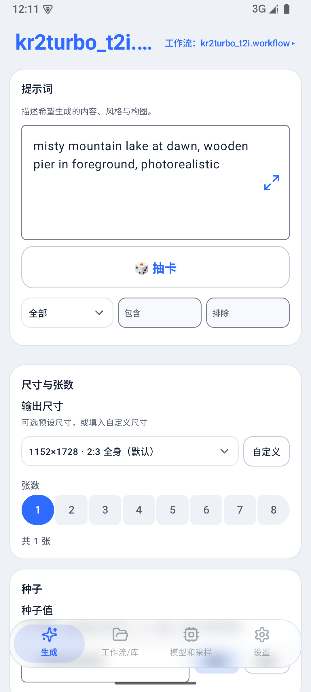
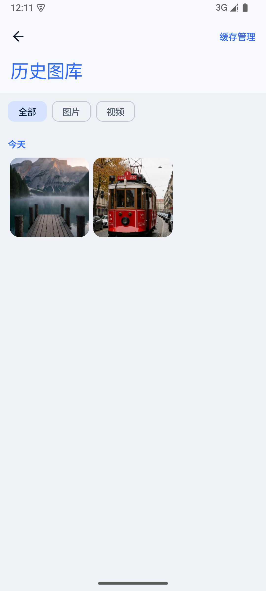
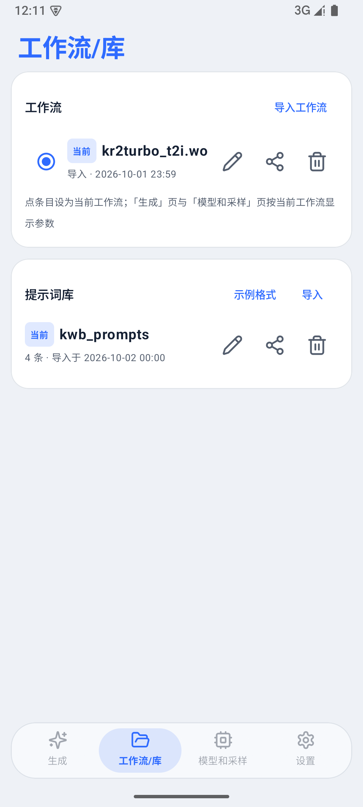
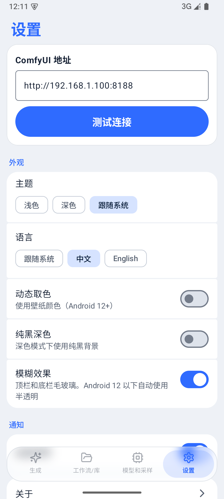
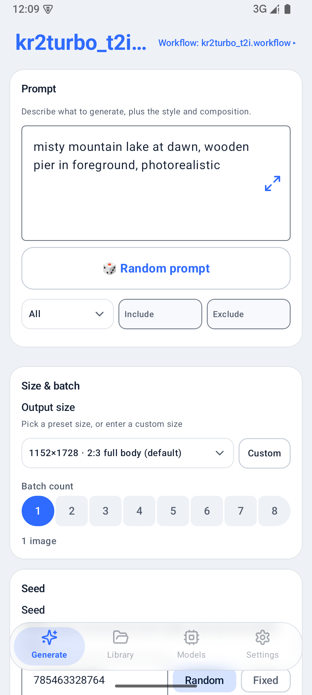
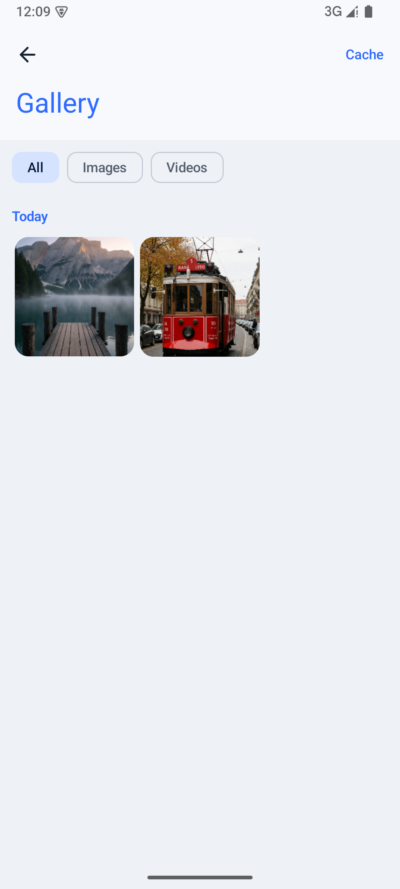
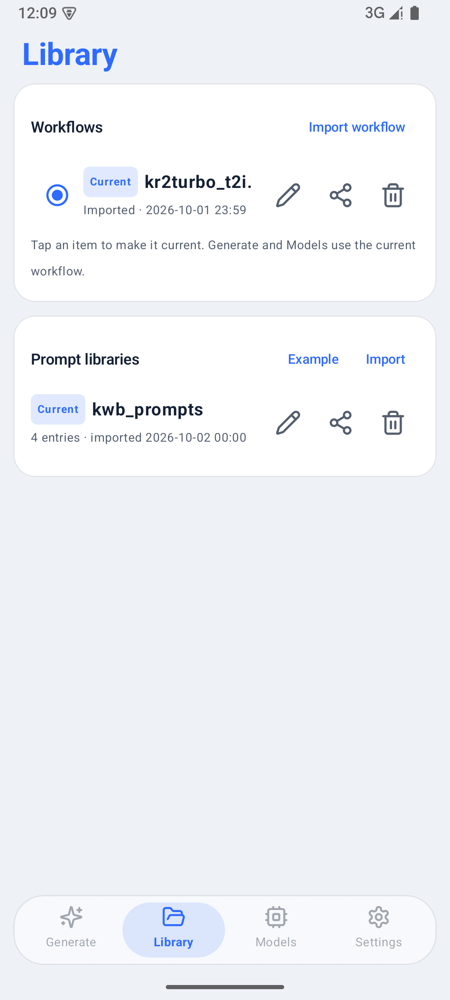
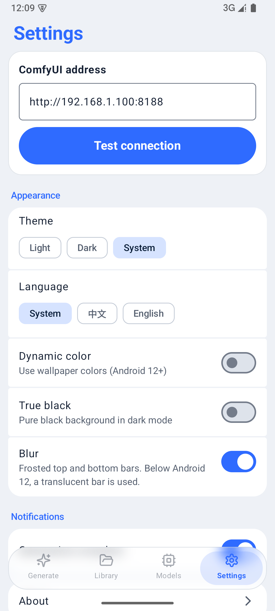

# Comfy工作台 (Comfy Workbench)

> 非官方的 ComfyUI 安卓客户端 · An unofficial Android client for ComfyUI

[](LICENSE)

**Comfy工作台** 是一个原生 Android(Kotlin + Jetpack Compose)应用,让你用手机直接操控局域网或远程机器上的 ComfyUI:出图、图生图、图生视频、管理提示词、浏览画廊——人不在电脑前,一样玩得动。

这个项目最初是作者的自用工具:人长期不在家,想用手机远程玩 ComfyUI,市面上的客户端用着不合手,索性自己写了一个,越写越大,最后决定开源。

## 功能特性

- **直连 ComfyUI**:HTTP + WebSocket 直连服务器,实时生成进度,无需任何中间服务
- **自定义工作流导入**:导入任意 API 格式的工作流 JSON,把参数映射成手机上的操作面板(示例见 `docs/example-workflows/`)
- **提示词库**:分类取词、随机抽卡、保存与编辑,攒自己的提示词资产
- **画廊**:图片 / 视频统一浏览,保存到系统相册,支持放大查看与视频播放
- **后台生成与下载**:生成和结果下载都由前台服务执行,锁屏 / 切走后照样跑完并存入 App 图库,进度通知栏可见
- **远程访问**:同一个地址框填内网或外网地址;外网地址可配账号密码(HTTP Basic Auth,适合放在 Caddy / Nginx 等反向代理后面),遇到 401 会自动展开账号密码框
- **队列管理**:查看队列、中断当前任务
- **现代化 UI**:Material 3 + 毛玻璃质感,单手操作友好
- **中英双语**:界面支持中文与英文,默认跟随系统语言,也可在「设置」中手动切换
- **更新检查**:每天最多一次向 GitHub 查询新版本,也可在「关于」里手动检查;不自动下载,不收集任何数据

## 截图

| 生成 | 画廊 | 工作流/库 | 设置 |
| --- | --- | --- | --- |
|  |  |  |  |

## 快速开始

> 系统要求:Android 8.0 及以上;Release APK 为 arm64-v8a / armeabi-v7a / x86 / x86_64 通用包。

1. 准备一台跑着 ComfyUI 的机器(PC / 服务器均可)
2. 手机和它**处于同一网络**,或通过下文的远程访问方式打通
3. 安装 APK(见右侧 Releases),首次打开填入 ComfyUI 地址,例如 `http://192.168.1.100:8188`
4. 在「工作流/库」导入一个 API 格式的工作流 JSON(可以用 `docs/example-workflows/` 里的示例,也可以用你自己的),开始生成

## 远程访问(不在家也能玩)

应用默认面向局域网(HTTP 明文)。人不在家时,推荐用内网穿透把家里的 ComfyUI 暴露给手机:

- **Tailscale**(推荐):零配置组网,手机和家里机器组虚拟局域网,填 Tailscale IP 即可
- **frp / 花生壳等端口转发**:公网 IP:端口直连,建议自行套 HTTPS 或用强密码保护 ComfyUI
- **反向代理 + 账号密码**:用 Caddy / Nginx 等把 ComfyUI 发布出去(建议 HTTPS)并开启 Basic Auth,在应用里填外网地址和账号密码即可;密码加密保存在手机本地

> 安全提示:应用与 ComfyUI 之间的通信是 HTTP 明文,这是局域网场景的常见取舍。请勿在不可信的公共网络中直连,公网场景务必经由 VPN / 隧道。

## 自定义工作流

在 ComfyUI 网页端把工作流导出为 **API 格式** JSON,在应用的「导入」里提交,即可把其中的参数(提示词、尺寸、步数、种子等)映射成手机面板。`docs/example-workflows/` 里有四个可直接参考的例子:

- `kr2turbo_t2i.workflow.json` — 文生图(Krea 2 Turbo)
- `kr2turbo_i2i.workflow.json` — 图生图
- `wan22_i2v_4step.workflow.json` — 图生视频(Wan2.2,4 步)
- `florence2_caption.workflow.json` — Florence-2 图片反推提示词

> 注意:示例工作流引用的模型文件(Krea2Turbo、Wan2.2、Florence2 等)需要你自己在 ComfyUI 端准备,并把节点里的模型名改成你实际拥有的模型。

## 构建

要求:JDK 17、Android SDK(`local.properties` 指向 SDK 路径)。

```bash
# Linux / macOS
./gradlew assembleRelease

# Windows
gradlew.bat assembleRelease
```

签名配置(可选):复制 `keystore.properties.example` 为 `keystore.properties` 并填入你的 keystore 信息;未配置时自动使用 debug 签名。

## FAQ

**连不上服务器?** 确认 ComfyUI 以 `--listen` 启动并监听 `0.0.0.0`(仅监听 127.0.0.1 时手机无法访问);确认防火墙放行 8188 端口;手机浏览器先访问 `http://<ip>:8188` 验证连通性。

**支持哪些模型?** 应用本身不限定模型——它驱动的是你的 ComfyUI 工作流。你导入的工作流用什么模型,它就用什么模型。

**会上传我的图片到云端吗?** 不会。所有通信只发生在手机与你自己的 ComfyUI 服务器之间,无任何第三方服务。

## License

本项目以 [GPL-3.0](LICENSE) 协议开源。

- UI 视觉思路参考自 [rikkahub](https://github.com/rikkahub/rikkahub)(AGPL-3.0),实现为独立编写
- 启动器图标使用了 [Comfy-Org/ComfyUI_frontend](https://github.com/Comfy-Org/ComfyUI_frontend) 的 ComfyUI logomark
- ComfyUI 及 ComfyUI 标志为 Comfy Org 的商标;本项目为独立开发,与 Comfy Org 无关(unofficial, not affiliated)

---

## English

**Comfy Workbench** is a native Android (Kotlin + Jetpack Compose) client for your self-hosted ComfyUI server: text-to-image, image-to-image, image-to-video, a prompt library, and a gallery — all over direct HTTP + WebSocket, with no cloud service in between.

- Import any API-format workflow JSON (examples for t2i / i2i / Wan2.2 i2v / Florence-2 image-to-prompt in `docs/example-workflows/`)
- Requires Android 8.0+; the Release APK is a universal build (arm64-v8a / armeabi-v7a / x86 / x86_64)
- Real-time progress; generation and result download run in a foreground service, so they finish even with the screen locked; queue & interrupt
- Remote access: one address field for LAN or remote URLs; HTTP Basic Auth supported (e.g. behind a Caddy / Nginx reverse proxy), and the username/password fields expand automatically on 401
- Update check: asks GitHub for a new release at most once a day, or manually from About; no auto-download, no data collected
- Chinese and English UI: follows the system language by default, switchable in Settings
- Example API-format workflows live in `docs/example-workflows/`
- Designed for LAN use; for remote access pair it with Tailscale / frp, or a reverse proxy with HTTPS + Basic Auth (plain HTTP traffic should go through a tunnel on untrusted networks)

### Screenshots

| Generate | Gallery | Workflows / Library | Settings |
| --- | --- | --- | --- |
|  |  |  |  |

Build: JDK 17 + Android SDK, then `./gradlew assembleRelease`. See the Chinese sections above for full details.

Licensed under **GPL-3.0**. Unofficial project — not affiliated with Comfy Org. ComfyUI and the ComfyUI logo are trademarks of Comfy Org.

## 关于开发 / About

本项目的代码一行都不是我写的。我不会写代码，在这里当项目经理、监工兼测试员：定需求、盯进度、真机找 bug。代码全部由 AI 编写（Grok 家族 + 智谱 GLM）。项目主要自用，随缘更新，不保证维护；有需要欢迎 fork 自行修改。

I can't code, and I didn't write a single line of this project. I acted as project manager, supervisor and tester: setting requirements, reviewing progress and finding bugs on a real phone. All code was written by AI (the Grok family + Zhipu GLM). This is mainly for personal use and updated whenever I feel like it, with no maintenance guarantee. Feel free to fork and change it yourself.
